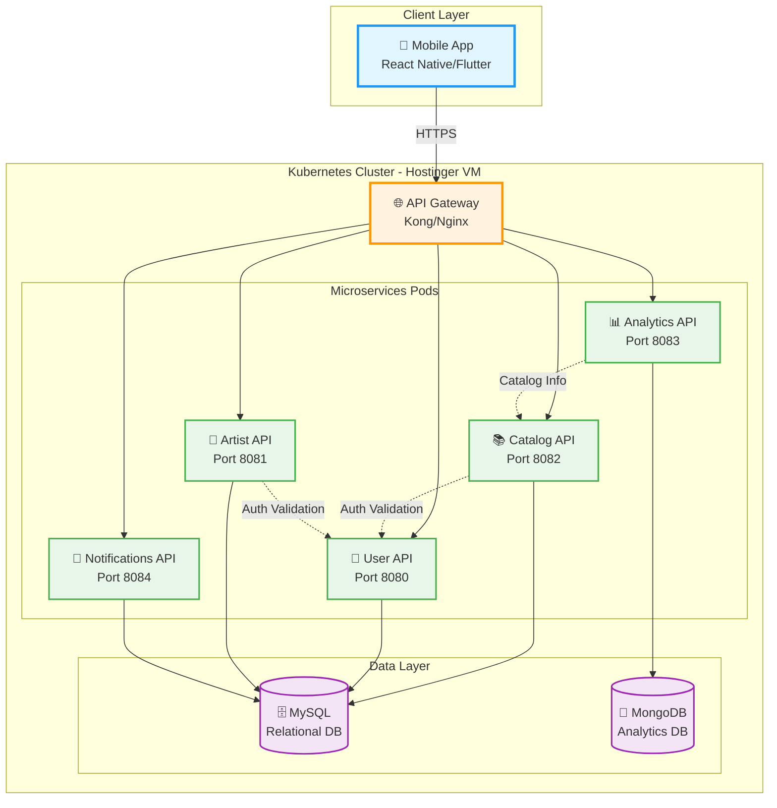
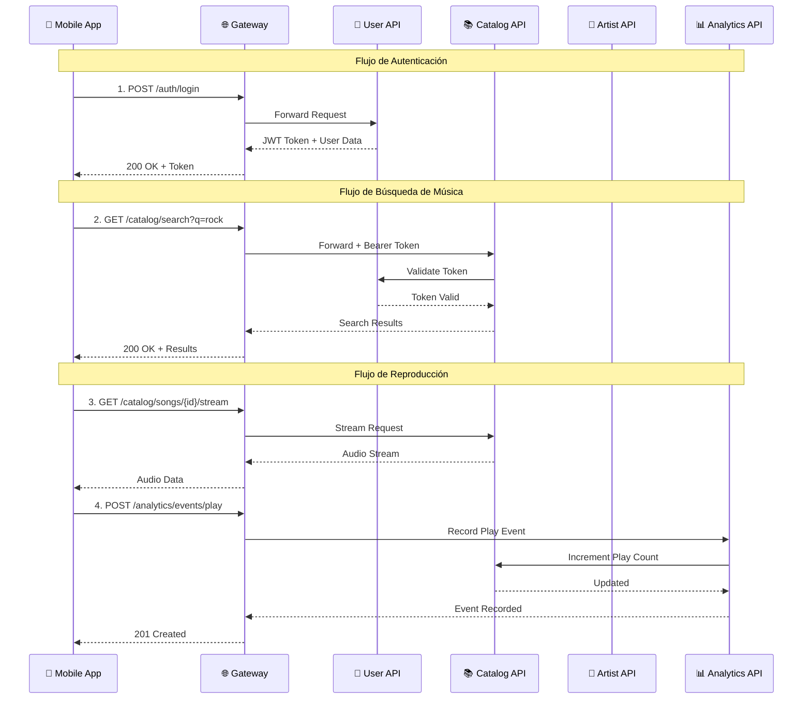
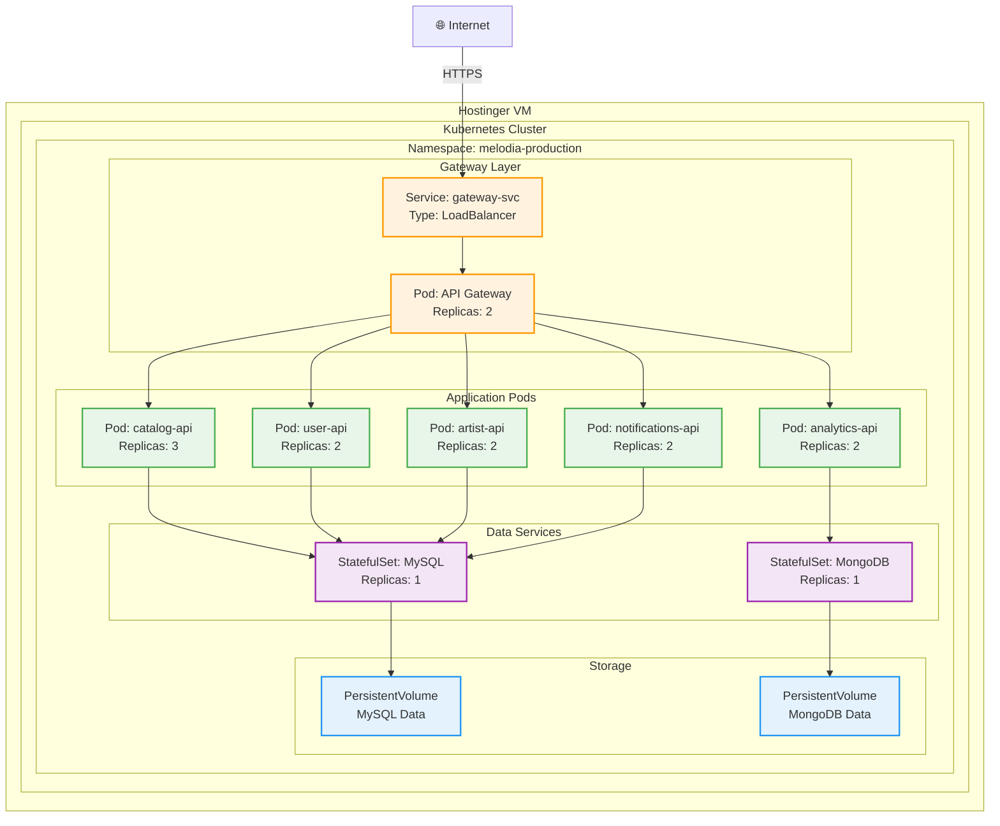

# Melodía - Music Streaming Platform

<div align="center">

🎵 **Plataforma completa de streaming musical con administración avanzada** 🎵

[](https://kubernetes.io/)
[](https://reactjs.org/)
[](https://www.mysql.com/)
[](https://www.mongodb.com/)
[](https://golang.org/)

</div>

---

## 📖 Índice

- [Descripción General](#-descripción-general)
- [Componentes de la Plataforma](#-componentes-de-la-plataforma)
- [Arquitectura del Sistema](#-arquitectura-del-sistema)
- [Microservicios](#-microservicios)
- [Tecnologías](#-tecnologías)
- [Infraestructura](#-infraestructura)
- [Documentación Detallada](#-documentación-detallada)
- [Guía Rápida](#-guía-rápida)

---

## 🎯 Descripción General

**Melodía** es una plataforma completa de streaming musical, similar a Spotify, diseñada con una arquitectura de microservicios moderna y escalable. La plataforma consta de tres componentes principales:

1. **📱 Mobile App** - Aplicación móvil para usuarios finales
2. **💼 Backoffice Admin** - Panel de administración web
3. **🔧 Backend Microservices** - APIs y servicios backend

La plataforma permite a los usuarios descubrir, reproducir y gestionar música, mientras proporciona a los artistas herramientas para gestionar su presencia y métricas. Los administradores tienen un panel completo para gestionar contenido, usuarios, políticas regionales y analytics.

### Características Principales

- 🎵 **Catálogo Musical Completo** - Álbumes, singles, EPs, playlists
- 👤 **Gestión de Usuarios** - Registro, autenticación, perfiles
- 🎤 **Perfiles de Artistas** - Biografías, discografía, redes sociales
- 📊 **Analytics en Tiempo Real** - Métricas de reproducción y engagement
- 🔔 **Sistema de Notificaciones** - Alertas y actualizaciones
- 🔍 **Búsqueda Avanzada** - Search unificado en todo el catálogo
- ❤️ **Interacciones Sociales** - Likes, saves, follows, playlists
- 🎧 **Streaming de Audio** - Reproducción en alta calidad
- 💼 **Panel de Administración** - Backoffice completo para gestión
- 🌍 **Políticas Regionales** - Control de disponibilidad por región

---

## 🏗️ Componentes de la Plataforma

### 1. 📱 Mobile App (React Native / Flutter)

**Descripción**: Aplicación móvil para usuarios finales (iOS y Android)

**Funcionalidades**:
- 🎵 Reproducción de música en streaming
- 🔍 Búsqueda de canciones, álbumes, artistas
- 📝 Creación y gestión de playlists
- ❤️ Sistema de likes y favoritos
- 👥 Follow de artistas
- 📊 Historial de reproducción
- 🎨 Interfaz intuitiva y responsive

**Tecnologías**:
- React Native / Flutter
- Redux / Context API para state management
- Axios para API calls
- AsyncStorage para persistencia local

**Comunicación**:
- Consume APIs REST a través del API Gateway
- Autenticación con JWT tokens
- WebSocket para notificaciones en tiempo real (futuro)

---

### 2. 💼 Backoffice Admin (React + TypeScript)

**Descripción**: Panel de administración web para gestión de la plataforma

**Funcionalidades Administrativas**:

#### 👥 Gestión de Usuarios
- Alta, baja, edición de usuarios
- Bloqueo/desbloqueo de cuentas
- Cambio de roles (Listener, Artist, Admin)
- Visualización detallada de perfiles
- Historial de actividad

#### 🎵 Gestión de Catálogo
- **CRUD completo** de álbumes, singles, EPs, canciones
- Gestión de playlists (públicas y privadas)
- Administración de géneros musicales
- Upload de archivos multimedia (audio, imágenes)
- Filtros avanzados y búsqueda
- Previsualización de contenido

#### 🌍 Políticas Regionales
- Creación de políticas de disponibilidad por región
- Configuración de periodos de restricción
- Interfaz visual para gestión de políticas
- Auditoría de cambios en políticas

#### 📊 Analytics y Métricas
- **Dashboard en tiempo real** con métricas clave:
    - Registros nuevos
    - Inicios de sesión
    - Reproducciones totales
    - Canciones más escuchadas
- **Filtros avanzados**:
    - Por periodo de tiempo
    - Por entorno (dev/prod)
    - Por región geográfica
    - Por tipo de usuario
    - Por método de login
- **Breakdowns por etiquetas**:
    - Distribución por región
    - Distribución por tipo de usuario
    - Análisis de métodos de autenticación
- **Exportación a CSV** para análisis externo
- Integración con DataDog para métricas avanzadas

#### 📝 Auditoría
- Registro de todas las acciones administrativas
- Historial detallado de cambios
- Filtros por usuario, fecha, tipo de acción
- Trazabilidad completa

**Tecnologías**:
- **Frontend**: React 18+ con TypeScript
- **Build Tool**: Vite
- **Styling**: CSS Modules
- **State Management**: React Context / Hooks
- **HTTP Client**: Fetch API / Axios
- **Storage**: Supabase para archivos multimedia

**Endpoints Consumidos**:
```
/api/v1/users/admin/users          # Gestión de usuarios
/api/v1/catalog                     # Gestión de catálogo
/api/v1/catalog/policy              # Políticas regionales
/api/v1/analytics/audit             # Auditoría
/api/v1/analytics/metrics           # Métricas y breakdowns
/api/v1/artists                     # Gestión de artistas
```

**Configuración**:
```env
VITE_API_URL=http://xyziverse.xyz:32260
VITE_API_URL_ARTIST=http://artist-api:8081
EXPO_PUBLIC_SUPABASE_URL=https://your-project.supabase.co
EXPO_PUBLIC_SUPABASE_ANON_KEY=your_anon_key
```

**Características de Seguridad**:
- Autenticación JWT obligatoria
- Roles y permisos (solo Admin)
- Manejo de expiración de sesión
- Logout centralizado
- Validación de formularios
- Sanitización de inputs

---

### 3. 🔧 Backend Microservices

**Descripción**: Conjunto de microservicios independientes para lógica de negocio

---

## 🏗️ Arquitectura del Sistema

Melodía utiliza una **arquitectura de microservicios** desplegada en **Kubernetes** en una máquina virtual de Hostinger.

### Diagrama de Alto Nivel



### Flujo de Comunicación



---

## 🔧 Microservicios

### 1. 📚 Catalog API

**Responsabilidad**: Gestión completa del catálogo musical

**Funcionalidades**:
- Gestión de álbumes, singles, EPs
- Playlists (públicas y privadas)
- Géneros musicales
- Sistema de likes/saves
- Búsqueda unificada
- Streaming de audio

**Base de Datos**: MySQL  
**Puerto**: 8082  
**[📖 Documentación Detallada](./docs/CATALOG_API.md)**

---

### 2. 👤 User API

**Responsabilidad**: Gestión de usuarios y autenticación

**Funcionalidades**:
- Registro y login (email/OAuth)
- Gestión de perfiles
- Sistema de follow/unfollow
- Validación de tokens (JWT)
- Gestión de sesiones

**Base de Datos**: MySQL  
**Puerto**: 8080  
**[📖 Documentación Detallada](./docs/USER_API.md)**

---

### 3. 🎤 Artist API

**Responsabilidad**: Gestión de artistas y sus perfiles

**Funcionalidades**:
- Perfiles de artistas (biografía, fotos)
- Redes sociales
- Carrusel de imágenes
- Artist Picks (contenido destacado)
- Artistas relacionados
- Métricas (monthly listeners)

**Base de Datos**: MySQL  
**Puerto**: 8081  
**[📖 Documentación Detallada](./docs/ARTIST_API.md)**

---

### 4. 📊 Analytics API

**Responsabilidad**: Métricas y análisis de uso

**Funcionalidades**:
- Registro de eventos de reproducción
- Historial de reproducción
- Top songs por artista
- Eventos de auditoría
- Estadísticas de engagement

**Base de Datos**: MongoDB  
**Puerto**: 8083  
**[📖 Documentación Detallada](./docs/ANALYTICS_API.md)**

---

### 5. 🔔 Notifications API

**Responsabilidad**: Sistema de notificaciones

**Funcionalidades**:
- Notificaciones push
- Notificaciones in-app
- Alertas de nuevos lanzamientos
- Notificaciones de interacciones sociales

**Base de Datos**: MySQL  
**Puerto**: 8084  
**[📖 Documentación Detallada](./docs/NOTIFICATIONS_API.md)**

---

## 💻 Tecnologías

### Backend

| Tecnología | Uso | Versión |
|------------|-----|---------|
| **Go (Golang)** | Lenguaje principal de APIs | 1.24+ |
| **Gin** | Framework HTTP | Latest |
| **GORM** | ORM para MySQL | v2 |
| **MongoDB Driver** | Cliente MongoDB | Latest |

### Bases de Datos

| Base de Datos | Uso | Servicios |
|---------------|-----|-----------|
| **MySQL 8.0** | Datos relacionales | Catalog, User, Artist, Notifications |
| **MongoDB** | Datos de analytics | Analytics |

### Infraestructura

| Componente | Tecnología | Descripción |
|------------|------------|-------------|
| **Orquestación** | Kubernetes | Gestión de contenedores |
| **Hosting** | Hostinger VM | Máquina virtual dedicada |
| **Gateway** | Kong/Nginx | Routing y load balancing |
| **Contenedores** | Docker | Empaquetado de servicios |
| **Storage** | Supabase | Almacenamiento de archivos |

### Observabilidad

| Herramienta | Uso |
|-------------|-----|
| **DataDog APM** | Monitoreo y trazabilidad |
| **Uber Zap** | Logging estructurado |
| **Prometheus** | Métricas (opcional) |

---

## ☁️ Infraestructura

### Kubernetes Deployment



### Configuración de Pods

| Servicio | CPU Request | CPU Limit | Memory Request | Memory Limit | Replicas |
|----------|-------------|-----------|----------------|--------------|----------|
| Gateway | 100m | 500m | 128Mi | 512Mi | 2 |
| Catalog API | 200m | 1000m | 256Mi | 1Gi | 3 |
| User API | 100m | 500m | 128Mi | 512Mi | 2 |
| Artist API | 100m | 500m | 128Mi | 512Mi | 2 |
| Analytics API | 150m | 750m | 256Mi | 1Gi | 2 |
| Notifications API | 100m | 500m | 128Mi | 512Mi | 2 |

---

## 📚 Documentación Detallada

### Diagramas de Arquitectura

- **[🏗️ Arquitectura General](./diagrams/SYSTEM_ARCHITECTURE.md)** - Vista completa del sistema
- **[🔄 Flujos de Comunicación](./diagrams/COMMUNICATION_FLOWS.md)** - Interacciones entre servicios
- **[🗄️ Esquema de Base de Datos](./diagrams/DATABASE_SCHEMA.md)** - Estructura de datos
- **[☁️ Infraestructura Kubernetes](./diagrams/KUBERNETES_INFRASTRUCTURE.md)** - Deployment detallado
- **[🔐 Autenticación y Seguridad](./diagrams/AUTHENTICATION.md)** - Flujos de auth

### Documentación por API

- **[📚 Catalog API](./docs/CATALOG_API.md)** - Gestión del catálogo musical
- **[👤 User API](./docs/USER_API.md)** - Usuarios y autenticación
- **[🎤 Artist API](./docs/ARTIST_API.md)** - Perfiles de artistas
- **[📊 Analytics API](./docs/ANALYTICS_API.md)** - Métricas y analytics
- **[🔔 Notifications API](./docs/NOTIFICATIONS_API.md)** - Sistema de notificaciones

### Guías Técnicas

- **[🚀 Guía de Deployment](./docs/DEPLOYMENT_GUIDE.md)** - Despliegue en Kubernetes
- **[⚙️ Configuración](./docs/CONFIGURATION.md)** - Variables de entorno
- **[🧪 Testing](./docs/TESTING_GUIDE.md)** - Estrategia de pruebas
- **[🔍 Troubleshooting](./docs/TROUBLESHOOTING.md)** - Resolución de problemas
- **[📈 Monitoring](./docs/MONITORING.md)** - Observabilidad y alertas

---

## 🚀 Guía Rápida

### Requisitos Previos

- Acceso a la VM de Hostinger
- kubectl configurado
- Docker (para desarrollo local)
- Go 1.24+ (para desarrollo)

### Desplegar en Kubernetes

```bash
# 1. Conectar al cluster
kubectl config use-context melodia-production

# 2. Aplicar configuraciones
kubectl apply -f k8s/namespace.yaml
kubectl apply -f k8s/configmaps/
kubectl apply -f k8s/secrets/
kubectl apply -f k8s/databases/
kubectl apply -f k8s/services/

# 3. Verificar deployments
kubectl get pods -n melodia-production

# 4. Ver logs
kubectl logs -f deployment/catalog-api -n melodia-production
```

### Desarrollo Local

```bash
# 1. Clonar repositorio
git clone https://github.com/melodia/melodia-platform.git
cd melodia-platform

# 2. Iniciar bases de datos
docker-compose up -d mysql mongodb

# 3. Iniciar un servicio (ejemplo: Catalog API)
cd catalog-api
cp .env.example .env
go run cmd/main.go

# 4. El servicio estará disponible en http://localhost:8082
```

### Endpoints Principales

| Servicio | Base URL | Health Check |
|----------|----------|--------------|
| **Gateway** | `https://api.melodia.com` | - |
| **Catalog** | `/api/v1/catalog` | `GET /health` |
| **User** | `/api/v1/users` | `GET /health` |
| **Artist** | `/api/v1/artists` | `GET /health` |
| **Analytics** | `/api/v1/analytics` | `GET /health` |
| **Notifications** | `/api/v1/notifications` | `GET /health` |

---

## 🔐 Autenticación

Todos los endpoints (excepto `/health` y endpoints públicos) requieren autenticación JWT:

```bash
# 1. Obtener token
curl -X POST https://api.melodia.com/api/v1/users/auth/login \
  -H "Content-Type: application/json" \
  -d '{
    "email": "user@example.com",
    "password": "password123"
  }'

# 2. Usar token en requests
curl https://api.melodia.com/api/v1/catalog/albums \
  -H "Authorization: Bearer <your-jwt-token>"
```

---

## 📊 Monitoring y Observabilidad

### DataDog Dashboard

Accede a [DataDog](https://app.datadoghq.com) para ver:
- Request rates y latencias
- Error rates por servicio
- Distributed tracing
- Resource utilization

### Logs

```bash
# Ver logs de un servicio específico
kubectl logs -f deployment/catalog-api -n melodia-production

# Ver logs de todos los pods de un servicio
kubectl logs -f -l app=catalog-api -n melodia-production

# Ver logs con timestamp
kubectl logs --since=1h deployment/catalog-api -n melodia-production
```

### Métricas

```bash
# Ver métricas de pods
kubectl top pods -n melodia-production

# Ver métricas de nodos
kubectl top nodes
```

---

## 🤝 Contribuir

Para contribuir al proyecto:

1. Fork el repositorio
2. Crea una rama para tu feature (`git checkout -b feature/AmazingFeature`)
3. Commit tus cambios (`git commit -m 'Add some AmazingFeature'`)
4. Push a la rama (`git push origin feature/AmazingFeature`)
5. Abre un Pull Request

---

## 📄 Licencia

Este proyecto es propiedad privada de Melodía. Todos los derechos reservados.

---

## 📞 Contacto

- **Email**: dev@melodia.com
- **Slack**: #melodia-dev
- **Documentación**: https://docs.melodia.com

---

<div align="center">

**Hecho con ❤️ por el equipo de Melodía**

</div>


# Melodia Frontend

Aplicación móvil de Melodia construida con React Native y Expo.

## Comandos

```bash
npm install
npm run start
```

## Configuración de Variables de Entorno

Crear un archivo `.env` en la raíz del proyecto con las siguientes variables:

```env
EXPO_PUBLIC_API_URL={proxy}
EXPO_PUBLIC_SUPABASE_URL={supabase-url}
SUPABASE_ANON_KEY={supabase-url}
```

Puedes usar el archivo `.env.example` como plantilla.

## Arquitectura de APIs

La aplicación se conecta a tres microservicios diferentes:

### 1. User API
- Gestión de usuarios y perfiles
- Autenticación y autorización
- Follow/Unfollow de artistas
- Búsqueda de perfiles

### 2. Artist API
- Información de artistas
- Métricas de artistas (monthly listeners, etc.)
- Búsqueda de artistas

### 3. Catalog API
- **Catálogo completo de música**: álbumes, EPs, singles
- Discografía de artistas
- Lanzamientos próximos (upcoming releases)
- Búsqueda de contenido musical

## Funcionalidades Principales

### Búsqueda Universal
- Busca artistas, usuarios, álbumes, EPs y singles desde una sola interfaz
- Resultados categorizados y organizados
- Navegación directa a pantallas de detalle

### Pantallas de Detalle
- **AlbumDetailScreen**: Visualiza información completa de un álbum
- **EPDetailScreen**: Visualiza información completa de un EP
- **SingleDetailScreen**: Visualiza y reproduce singles
- **ArtistProfileScreen**: Perfil completo del artista con discografía
- **UpcomingReleasesScreen**: Próximos lanzamientos del artista

### Integración con Catalog API
Toda la música (álbumes, EPs, singles) se obtiene desde `catalog-api`:
- `/api/v1/catalog/albums` - Álbumes
- `/api/v1/catalog/eps` - EPs
- `/api/v1/catalog/singles` - Singles
- `/api/v1/catalog/albums/upcoming` - Álbumes próximos
- `/api/v1/catalog/eps/upcoming` - EPs próximos
- `/api/v1/catalog/singles/upcoming` - Singles próximos
- `/api/v1/catalog/search` - Búsqueda en catálogo

## Estructura del Proyecto

```
app/
├── components/        # Componentes reutilizables
│   └── SearchModal.tsx
├── context/          # Contextos de React
│   ├── AuthContext.tsx
│   └── ThemeContext.tsx
├── screens/          # Pantallas de la aplicación
│   ├── AlbumDetailScreen.tsx
│   ├── EPDetailScreen.tsx
│   ├── SingleDetailScreen.tsx
│   ├── ArtistProfileScreen.tsx
│   ├── UpcomingReleasesScreen.tsx
│   └── ...
└── services/         # Servicios de API
    ├── httpCatalog.ts    # Cliente HTTP para catalog-api
    ├── catalog.ts        # Servicio de catálogo
    ├── httpArtist.ts     # Cliente HTTP para artist-api
    ├── artist.ts         # Servicio de artistas
    ├── httpClientUser.ts # Cliente HTTP para user-api
    └── profile.ts        # Servicio de perfiles
```

## Cambios

### Migración a Catalog API
- **Antes**: La música se obtenía desde artist-api
- **Ahora**: Toda la música se obtiene desde catalog-api centralizado
- **Beneficio**: Fuente única de verdad para contenido musical

## Pruebas de Login Federado (Google)

Para probar funcionalidades como el login con Google, que dependen de esquemas de URL personalizados (`melodia-app://`), es necesario utilizar un "development build" en lugar de la aplicación Expo Go.

Sigue estos pasos para crear y ejecutar un development build en Android:

1.  **Instalar el cliente de desarrollo de Expo:**
    ```bash
    npm install --save-dev expo-dev-client
    ```

2.  **(Opcional) Instalar dependencias para Android en Linux:**
    Si no tienes el JDK de Java, puedes instalarlo con el siguiente comando:
    ```bash
    sudo apt update && sudo apt install -y openjdk-17-jdk unzip
    ```

3.  **Ejecutar el build de desarrollo:**
    Con un dispositivo Android conectado a tu computadora (con depuración USB habilitada) o un emulador de Android en ejecución, ejecuta:
    ```bash
    npx expo run:android
    ```
Este comando compilará e instalará la aplicación en tu dispositivo o emulador, permitiéndote probar el flujo de autenticación de Google.