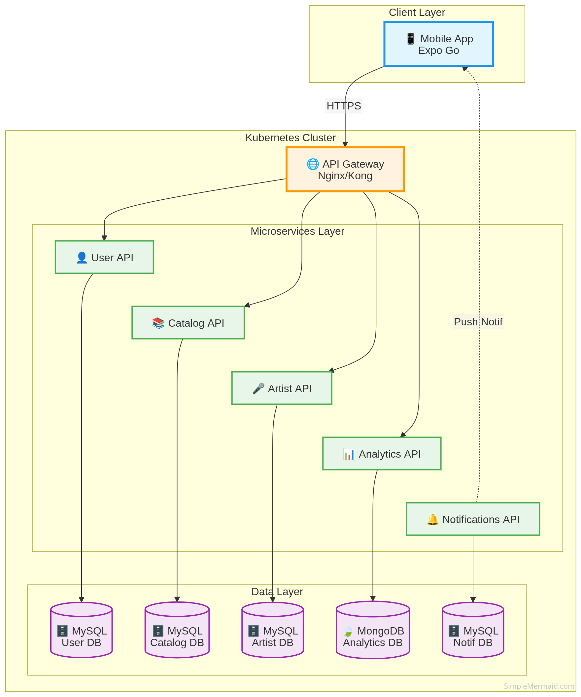
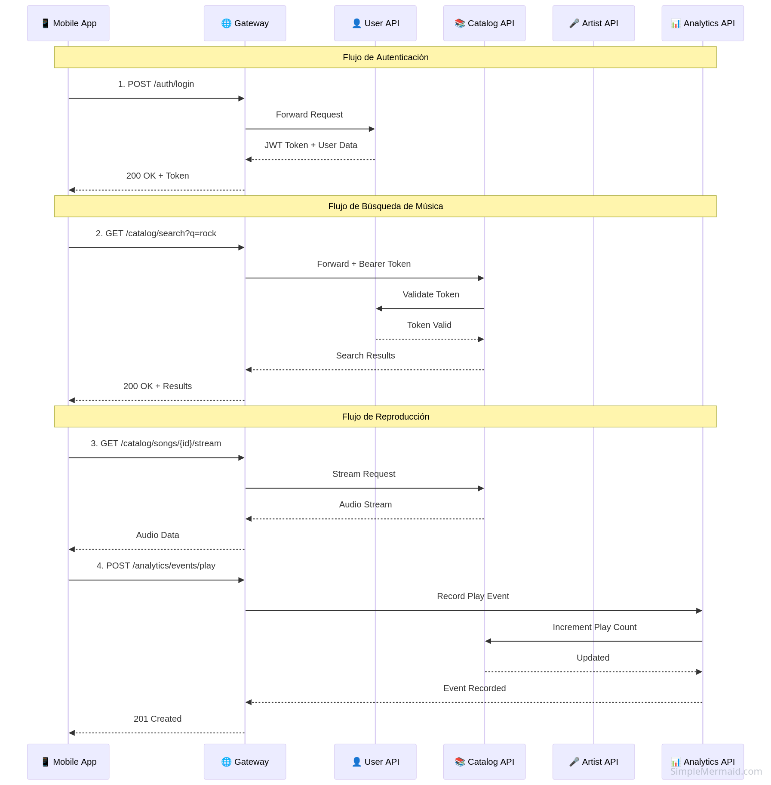
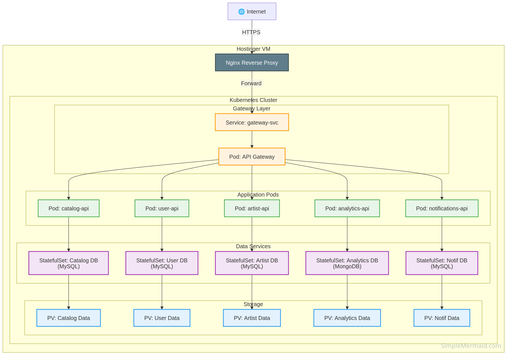
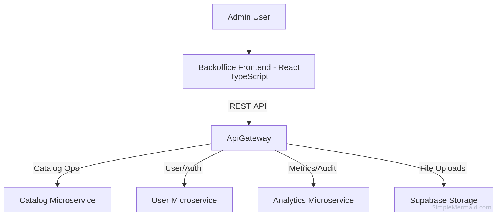

# Melodía - Music Streaming Platform

<div align="center">

🎵 **Plataforma completa de streaming musical con administración avanzada** 🎵

[](https://kubernetes.io/)
[](https://reactjs.org/)
[](https://www.mysql.com/)
[](https://www.mongodb.com/)
[](https://golang.org/)
[](https://nodejs.org/)

</div>

---

## 📖 Índice

- [Descripción General](#-descripción-general)
- [Componentes de la Plataforma](#-componentes-de-la-plataforma)
- [Arquitectura del Sistema](#-arquitectura-del-sistema)
- [Microservicios](#-microservicios)
- [Tecnologías](#-tecnologías)
  - [Backend](#backend)
  - [Bases de Datos](#bases-de-datos)
  - [Infraestructura](#infraestructura)
  - [Observabilidad](#observabilidad)
- [Documentación Detallada](#-documentación-detallada)
  - [Kubernetes Deployment](#kubernetes-deployment)
  - [Backoffice](#backoffice)
  - [Documentación por API](#documentación-por-api)
- [Licencia](#-licencia)
- [Repositorio de Documentación](#documentación-httpsgithubcommelodia13melodiagithubio)

---

## 🎯 Descripción General

**Melodía** es una plataforma completa de streaming musical, similar a Spotify, diseñada con una arquitectura de microservicios moderna y escalable. La plataforma consta de tres componentes principales:

1. **📱 Mobile App** - Aplicación móvil para usuarios finales
2. **💼 Backoffice Admin** - Panel de administración web
3. **🔧 Backend Microservices** - APIs y servicios backend

La plataforma permite a los usuarios descubrir, reproducir y gestionar música, mientras proporciona a los artistas herramientas para gestionar su presencia y métricas. Los administradores tienen un panel completo para gestionar contenido, usuarios, políticas regionales y analytics.

### Características Principales

- 🎵 **Catálogo Musical Completo** - Álbumes, singles, EPs, playlists
- 👤 **Gestión de Usuarios** - Registro, autenticación, perfiles
- 🎤 **Perfiles de Artistas** - Biografías, discografía, redes sociales
- 📊 **Analytics en Tiempo Real** - Métricas de reproducción y engagement
- 🔔 **Sistema de Notificaciones** - Alertas y actualizaciones
- 🔍 **Búsqueda Avanzada** - Search unificado en todo el catálogo
- ❤️ **Interacciones Sociales** - Likes, saves, follows, playlists
- 🎧 **Streaming de Audio** - Reproducción en alta calidad
- 💼 **Panel de Administración** - Backoffice completo para gestión
- 🌍 **Políticas Regionales** - Control de disponibilidad por región

---

## 🏗️ Componentes de la Plataforma

### 1. 📱 Mobile App (Expo go / React Native)

**Descripción**: Aplicación móvil para usuarios finales (Android)

**Funcionalidades**:
- 🎵 Reproducción de música en streaming
- 🔍 Búsqueda de canciones, álbumes, artistas
- 📝 Creación y gestión de playlists
- ❤️ Sistema de likes y favoritos
- 👥 Follow de artistas
- 📊 Historial de reproducción
- 🎨 Interfaz intuitiva y responsive

**Tecnologías**:
- Expo Go / React Native
- Redux / Context API para state management
- Axios para API calls
- AsyncStorage para persistencia local

**Comunicación**:
- Consume APIs REST a través del API Gateway
- Autenticación con JWT tokens

---

### 2. 💼 Backoffice Admin (React + TypeScript)

**Descripción**: Panel de administración web para gestión de la plataforma

**Funcionalidades Administrativas**:

#### 👥 Gestión de Usuarios
- Alta, baja, edición de usuarios
- Bloqueo/desbloqueo de cuentas
- Cambio de roles (Listener, Artist, Admin)
- Visualización detallada de perfiles

#### 🎵 Gestión de Catálogo
- Visualizacion de playlists (públicas y privadas)
- Upload de archivos multimedia (audio, imágenes)
- Filtros avanzados y búsqueda
- Previsualización de contenido

#### 🌍 Políticas Regionales
- Creación de políticas de disponibilidad por región
- Configuración de periodos de restricción
- Interfaz visual para gestión de políticas
- Auditoría de cambios en políticas

#### 📊 Analytics y Métricas
- **Dashboard con métricas clave**:
    - Usuarios
        - Registros nuevos
        - Inicios de sesión
        - Reproducciones totales
        - Canciones más escuchadas
    - Catalogo
        - Canciones
        - Albums
        - Artistas
- **Filtros**:
    - Por periodo de tiempo
    - Por entorno (dev/prod)
    - Por región geográfica
    - Por tipo de usuario
- **Breakdowns por etiquetas**:
    - Distribución por región
    - Distribución por tipo de usuario
    - Análisis de métodos de autenticación
- **Exportación a CSV** para análisis externo
- Integración con DataDog para métricas avanzadas

#### 📝 Auditoría
- Historial de cambios

**Tecnologías**:
- **Frontend**: React 18+ con TypeScript
- **Build Tool**: Vite
- **Styling**: CSS Modules
- **State Management**: React Context / Hooks
- **HTTP Client**: Fetch API / Axios
- **Integracion**: Supabase para archivos multimedia


**Configuración**:
```env
VITE_API_URL=https://xyziverse.xyz
VITE_API_URL_ARTIST=https://xyziverse.xyz
EXPO_PUBLIC_SUPABASE_URL=https://your-project.supabase.co
EXPO_PUBLIC_SUPABASE_ANON_KEY=your_anon_key
```

**Características de Seguridad**:
- Autenticación JWT obligatoria
- Roles y permisos (solo Admin)
- Manejo de expiración de sesión
- Logout centralizado
- Validación de formularios

---

### 3. 🔧 Backend Microservices

**Descripción**: Conjunto de microservicios independientes para lógica de negocio

## 🏗️ Arquitectura del Sistema

Melodía utiliza una **arquitectura de microservicios** desplegada en **Kubernetes** en una máquina virtual de Hostinger.

### Diagrama de Alto Nivel




### Flujo de Comunicación




## 🔧 Microservicios

### 1. 📚 Catalog API

**Responsabilidad**: Gestión completa del catálogo musical

**Funcionalidades**:
- Gestión de álbumes, singles, EPs
- Playlists (públicas y privadas)
- Géneros musicales
- Sistema de likes/saves/shares
- Búsqueda unificada
- Streaming de audio

**Base de Datos**: MySQL  

---

### 2. 👤 User API

**Responsabilidad**: Gestión de usuarios y autenticación

**Funcionalidades**:
- Registro y login (email/federado)
- Gestión de perfiles
- Sistema de follow/unfollow
- Validación de tokens (JWT)
- Gestión de sesiones

**Base de Datos**: MySQL  
---

### 3. 🎤 Artist API

**Responsabilidad**: Gestión de artistas y sus perfiles

**Funcionalidades**:
- Perfiles de artistas (biografía, fotos)
- Redes sociales
- Carrusel de imágenes
- Artist Picks (contenido destacado)
- Artistas relacionados
- Métricas (monthly listeners)

**Base de Datos**: MySQL  

---

### 4. 📊 Analytics API

**Responsabilidad**: Métricas y análisis de uso

**Funcionalidades**:
- Registro de eventos de reproducción
- Historial de reproducción
- Top songs por artista
- Eventos de auditoría

**Base de Datos**: MongoDB  

---

### 5. 🔔 Notifications API

**Responsabilidad**: Sistema de notificaciones

**Funcionalidades**:
- Notificaciones push
- Notificaciones in-app
- Alertas de nuevos lanzamientos
- Notificaciones de interacciones sociales

**Base de Datos**: MySQL  

---

## 💻 Tecnologías

### Backend

| Tecnología | Uso |
|------------|-----|
| **Go (Golang)** | Lenguaje principal de APIs |
| **JavaScript** | Lenguaje principal de APIs |
| **N8N** | Automatizaciones |
| **Gin** | Framework HTTP |
| **GORM** | ORM para MySQL |
| **MongoDB Driver** | Cliente MongoDB |

### Bases de Datos

| Base de Datos | Uso | Servicios |
|---------------|-----|-----------|
| **MySQL 8.0** | Datos relacionales | Catalog, User, Artist, Notifications |
| **MongoDB** | Datos de analytics | Analytics |

### Infraestructura

| Componente | Tecnología | Descripción |
|------------|------------|-------------|
| **Orquestación** | Kubernetes | Gestión de contenedores |
| **Hosting** | Hostinger VM | Máquina virtual dedicada |
| **Gateway** | Kong/Nginx | Routing y load balancing |
| **Contenedores** | Docker | Empaquetado de servicios |
| **Storage** | Supabase | Almacenamiento de archivos |
| **Servicio**| Firebase | Servicio de mensajeria |
| **Google**| Autenticacion | Login federado |

### Observabilidad

| Herramienta | Uso |
|-------------|-----|
| **DataDog** | Monitoreo, trazabilidad y logs |
| **Zap** | Logging estructurado |

---


## 📚 Documentación Detallada

### Kubernetes Deployment



### Backoffice




### Documentación por API

- **[📚 Catalog API](https://github.com/Melodia13/catalog-api)** - Gestión del catálogo musical
- **[👤 User API](https://github.com/Melodia13/user-api)** - Usuarios y autenticación
- **[🎤 Artist API](https://github.com/Melodia13/artist-api)** - Perfiles de artistas
- **[📊 Analytics API](https://github.com/Melodia13/analytics-api)** - Métricas y analytics
- **[🔔 Notifications API](https://github.com/Melodia13/notifications-api)** - Sistema de notificaciones

---

## 📄 Licencia

Este proyecto es propiedad privada de Melodía. Todos los derechos reservados.


## **Documentación**: https://github.com/Melodia13/melodia.github.io

<div align="center">

**Hecho con ❤️ por el equipo de Melodía**

</div>

